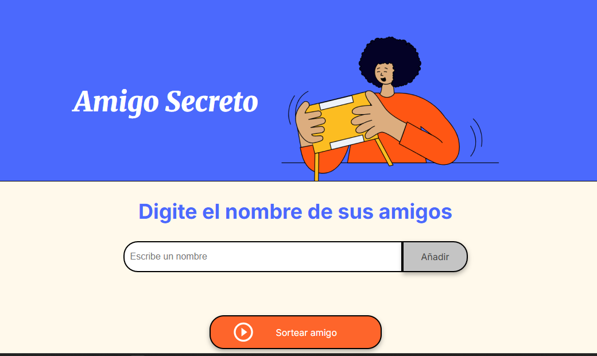

# 🎁 Juego del Amigo Secreto

Una aplicación web simple que permite registrar nombres de participantes y seleccionar aleatoriamente un nombre para el juego del Amigo Secreto. Ideal para fiestas, reuniones o celebraciones.

## ✨ Funcionalidades

- Permite digitar y añadir nombres a una lista.
- Los nombres se almacenan de forma dinámica en HTML.
- Al hacer clic en el botón "Sortear amigo", el sistema elige aleatoriamente un participante de la lista.
- Interfaz sencilla, clara y colorida para todos los públicos.

## 🛠️ Tecnologías utilizadas

- **HTML5** – estructura básica de la página.
- **CSS3** – estilos para dar diseño atractivo.
- **JavaScript** – lógica para manejar la lista y el sorteo aleatorio.

## 🚀 ¿Cómo usar?

1. Escribe el nombre de un amigo en el campo de texto.
2. Haz clic en **"Añadir"** para agregarlo a la lista.
3. Una vez agregados todos los nombres, haz clic en **"Sortear amigo"**.
4. El sistema seleccionará aleatoriamente un nombre de la lista y lo mostrara en la caja html.

